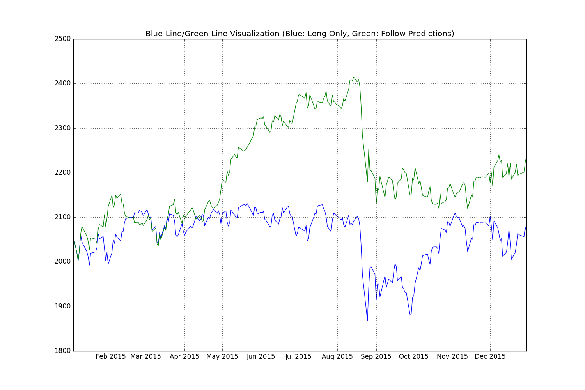

# pyspy

I present this repository, pyspy, to the Python Meetup 2016-01-18:

http://www.meetup.com/BayPIGgies/events/227481217

I intend for pyspy to run on Ubuntu 14 so I give instructions for installing and operating pyspy on Ubuntu 14.

If you want to run pyspy on a Mac I assume that you could easily generate and then follow instructions to run pyspy on a Mac.

If you want to run Ubuntu 14 as a guest inside your Mac, you can find information on the web for setting that up:

http://www.google.com/search?q=How+to+run+Ubuntu+as+Guest+of+Mac+OSX+with+VirtualBox+or+VMware+or+Parallels+or+Vagrant

Once you find good information, you will probably need a copy of Ubuntu 14:

http://releases.ubuntu.com/14.04/ubuntu-14.04.3-desktop-amd64.iso

If you want to run Ubuntu 14 as a guest of Windows I know that it is possible but be prepared for bad Windows behavior. For example I recently saw a windows10-virtualbox installation that failed to support copy-paste with a mouse.

# Install pyspy on Ubuntu 14

I like to install a wide variety of software on my Ubuntu host.  Some of the software listed below is probably not necessary but I like to have it available.

```
sudo apt-get update
sudo apt-get upgrade

sudo apt-get install autoconf bison build-essential libssl-dev libyaml-dev \
libreadline6-dev zlib1g-dev libncurses5-dev libffi-dev libgdbm3       \
libgdbm-dev libsqlite3-dev gitk postgresql postgresql-server-dev-all  \
libpq-dev emacs wget curl chromium-browser openssh-server aptitude    \
ruby ruby-dev sqlite3

sudo apt-get update
sudo apt-get upgrade
```

I like to install pyspy into this folder:

/home/ann/pyspy

You could try to install it elsewhere.

Anyway, I do this:

```
useradd ann -m -s /bin/bash
passwd ann
ssh -YA ann@localhost
```

Next I clone pyspy from github.com:

```
cd ~
git clone https://github.com/danbikle/pyspy
```

Then I install Anaconda Python:

```
cd ~
curl https://3230d63b5fc54e62148e-c95ac804525aac4b6dba79b00b39d1d3.ssl.cf1.rackcdn.com/Anaconda3-2.4.1-Linux-x86_64.sh > Anaconda3-2.4.1-Linux-x86_64.sh
bash Anaconda3-2.4.1-Linux-x86_64.sh
cd ~/anaconda3/bin
mv curl curl_ana
cd ~
echo 'export PATH=${HOME}/anaconda3/bin:$PATH' >> ~/.bashrc
bash
python
quit()
```

Next I install talib:

```
cd ~
curl http://skylineservers.dl.sourceforge.net/project/ta-lib/ta-lib/0.4.0/ta-lib-0.4.0-src.tar.gz > ta-lib-0.4.0-src.tar.gz
tar zxf ta-lib-0.4.0-src.tar.gz
cd      ta-lib-0.4.0-src
./configure --prefix=/usr
make
sudo make install
pip install TA-Lib
```

# Operate pyspy

I operate pyspy by running a shell script at 12:50pm California time:

```
~/pyspy/bin/noon50.bash
```

After I run the above script, I should see something like this:

```
ann@nia111:~ $ 
ann@nia111:~ $ 
ann@nia111:~ $ cd pyspy/
ann@nia111:~/pyspy $ 
ann@nia111:~/pyspy $ 
ann@nia111:~/pyspy $ bin/noon50.bash 
--2015-12-30 22:37:35--  http://ichart.finance.yahoo.com/table.csv?s=%5EGSPC
Resolving ichart.finance.yahoo.com (ichart.finance.yahoo.com)... 
Connecting to ichart.finance.yahoo.com (ichart.finance.yahoo.com)
HTTP request sent, awaiting response... 200 OK
Length: unspecified [text/csv]
Saving to: ‘GSPC.csv’

    [                         <=>       ] 1,195,127    242KB/s   in 6.1s   

2015-12-30 22:37:41 (193 KB/s) - ‘GSPC.csv’ saved [1195127]

--2015-12-30 22:37:41--  http://finance.yahoo.com/q?s=%5EGSPC
Resolving finance.yahoo.com (finance.yahoo.com)... 208.71.44.31, 
Connecting to finance.yahoo.com (finance.yahoo.com)|208.71.44.31|
HTTP request sent, awaiting response... 200 OK
Length: unspecified [text/html]
Saving to: ‘GSPC.html’

    [ <=>                              ] 72,992      --.-K/s   in 0.1s    

2015-12-30 22:37:42 (660 KB/s) - ‘GSPC.html’ saved [72992]

I am building features from this file:
GSPC2.csv
Busy...
I am building features from this file:
ftrGSPC2.csv
Busy...
True  positive count: 63
False positive count: 60
True  negative count: 71
False negative count: 57
Accuracy of positive predictions: 51.219%
Accuracy of negative predictions: 55.468%
Combined Accuracy of predictions: 53.386%
Positive Effectiveness: 0.0403%
Negative Effectiveness: -0.027%
Long Only Effectiveness: 0.0057%
hello, from /home/ann/pyspy/py/plotem.py
Plotting data from: learn_test.csv
New png file: 
learn_test.png
ann@nia111:~/pyspy $ 
ann@nia111:~/pyspy $ 
ann@nia111:~/pyspy $ 
```

The above report tells me both accuracy and effectiveness of pyspy on recent out of sample data.

After pyspy runs, I want to see the most recent predictions:

```
ann@nia111:~/ddata $ head -1 learn_test.csv
cdate,cp,pctlead,pctlag1,pctlag2,pctlag4,pctlag8,upf,lowf,prediction,pdir,lead_delta,actual_dir,greenline
ann@nia111:~/ddata $ 
ann@nia111:~/ddata $ tail learn_test.csv
2015-12-16,2073.070,-1.504,1.451,2.529,1.015,-0.890,1.005,1.038,0.484,-1.000,-31.180,-1.000,2190.470
2015-12-17,2041.890,-1.780,-1.504,-0.074,1.467,-1.694,1.019,1.023,0.536,1.000,-36.340,-1.000,2221.650
2015-12-18,2005.550,0.778,-1.780,-3.257,-0.811,-2.813,1.038,1.007,0.561,1.000,15.600,1.000,2185.310
2015-12-21,2021.150,0.882,0.778,-1.016,-1.089,-1.293,1.030,1.015,0.509,1.000,17.820,1.000,2200.910
2015-12-22,2038.970,1.242,0.882,1.666,-1.645,-0.646,1.021,1.024,0.480,-1.000,25.320,1.000,2218.730
2015-12-23,2064.290,-0.160,1.242,2.134,1.097,2.580,1.005,1.035,0.460,-1.000,-3.300,-1.000,2193.410
2015-12-24,2060.990,-0.218,-0.160,1.080,2.764,1.931,1.011,1.034,0.492,-1.000,-4.490,-1.000,2196.710
2015-12-28,2056.500,1.063,-0.218,-0.377,1.749,0.641,1.012,1.020,0.510,1.000,21.860,1.000,2201.200
2015-12-29,2078.360,-0.722,1.063,0.843,1.932,0.255,1.003,1.022,0.494,-1.000,-15.000,-1.000,2223.060
2015-12-30,2063.360,0.000,-0.722,0.334,-0.045,1.051,1.008,1.007,0.497,-1.000,0.000,0.000,2238.060
ann@nia111:~/ddata $ 
ann@nia111:~/ddata $ 
```

I see that the prediction issued at 12:50PM on 2015-12-30 is -1.000 which is a bearish prediction.
The pyspy script predicts that the closing price on 12-31 will probably be below 2063.36.

I see that  the prediction issued on 2015-12-29 was also -1.000 and that was an accurate prediction.

I see that  the prediction issued on 2015-12-28 was +1.000 and that was an accurate prediction.

I see that  the prediction issued on 2015-12-24 was -1.000 and that was an accurate prediction.

I see that  the prediction issued on 2015-12-23 was -1.000 and that was an accurate prediction.

I see that  the prediction issued on 2015-12-22 was -1.000 and that was a false negative.

An example of a false positive is the prediction issued for 2015-12-17.

I can use python to report on the predictions:

```
# rpt1.py

import pandas as pd
import numpy  as np
import pdb

test_df = pd.read_csv('learn_test.csv')

# I should count positive predictions.
posp_df  = test_df[['pdir','actual_dir']][test_df['pdir'] == 1]
# I should count true positive predictions.
tposp_df = posp_df[posp_df['actual_dir'] == 1]
# I should calculate positive accuracy.
pos_acc  = 100.0 * len(tposp_df)/len(posp_df)

# I should count negative predictions.
negp_df  = test_df[['pdir','actual_dir']][test_df['pdir'] == -1]
# I should count true negative predictions.
tnegp_df = negp_df[negp_df['actual_dir'] == -1]
# I should calculate negative accuracy.
neg_acc  = 100.0 * len(tnegp_df)/len(negp_df)

# I should calculate combined accuracy
com_acc  = 100.0 * (len(tposp_df)+len(tnegp_df))/len(test_df)

# I should calculate 'effectiveness'.
pos_pctlead_a = np.array(test_df[['pctlead']][test_df['pdir'] == 1])
pos_eff       = np.mean(pos_pctlead_a)
neg_pctlead_a = np.array(test_df[['pctlead']][test_df['pdir'] == -1])
neg_eff       = np.mean(neg_pctlead_a)
longonly_eff  = np.mean(test_df['pctlead'].values)
# I should report
print('True  positive count: '+str(len(tposp_df)))
print('False positive count: '+str(len(posp_df)-len(tposp_df)))
print('True  negative count: '+str(len(tnegp_df)))
print('False negative count: '+str(len(negp_df)-len(tnegp_df)))

print('Accuracy of positive predictions: ' +str(pos_acc)[:6]+'%')
print('Accuracy of negative predictions: ' +str(neg_acc)[:6]+'%')
print('Combined Accuracy of predictions: ' +str(com_acc)[:6]+'%')
print('Positive Effectiveness: '  +str(pos_eff)[:6]+'%')
print('Negative Effectiveness: '  +str(neg_eff)[:6]+'%')
print('Long Only Effectiveness: ' +str(longonly_eff)[:6]+'%')
```

When I run the above script I should see something like this:

```
ann@nia111:~/ddata $ 
ann@nia111:~/ddata $ 
ann@nia111:~/ddata $ python rpt1.py
True  positive count: 63
False positive count: 60
True  negative count: 71
False negative count: 57
Accuracy of positive predictions: 51.219%
Accuracy of negative predictions: 55.468%
Combined Accuracy of predictions: 53.386%
Positive Effectiveness: 0.0403%
Negative Effectiveness: -0.027%
Long Only Effectiveness: 0.0057%
ann@nia111:~/ddata $ 
ann@nia111:~/ddata $ 
```

In addition to the above report, I have a script which creates the 'Blue-Line-Green-Line Visualization':

```
# plotem.py

# This script should plot data in a CSV file

# Demo:
# cd ~/ddata
# python ~/pyspy/py/plotem.py learn_test.csv

import pandas as pd
import numpy  as np
import pdb
import datetime

# I should check cmd line arg
import sys

print('hello, from '+ sys.argv[0])

#  len(sys.argv) should == 2
if len(sys.argv) == 1:
  print('I need a command line arg.')
  print('Demo:')
  print('python '+sys.argv[0]+' learn_test.csv')
  print('Try again. bye.')
  sys.exit()

csvf = sys.argv[1]
print('Plotting data from: '+csvf)

# I should load the csv into a DataFrame
df1 = pd.read_csv(csvf)

# matplotlib likes dates:
cdate_l = [datetime.datetime.strptime(row, "%Y-%m-%d") for row in df1['cdate'].values]
# I should get values for y-axis now:
cp_l = [row for row in df1['cp']       ] 
gl_l = [row for row in df1['greenline']] 

# I should plot
import matplotlib
# http://matplotlib.org/faq/howto_faq.html#generate-images-without-having-a-window-appear
matplotlib.use('Agg')
# Order is important here.
# Do not move the next import:
import matplotlib.pyplot as plt
plt.figure(figsize=(15,10)) # 10inch x 5inch
plt.plot(cdate_l, cp_l, 'b-', cdate_l, gl_l, 'g-')
plt.title('Blue-Line/Green-Line Visualization (Blue: Long Only, Green: Follow Predictions)')
plt.grid(True)
pngf = csvf.replace('.csv','')+'.png'
plt.savefig(pngf)
plt.close()
print('New png file: ')
print(pngf)
'done'
```

When I run that script I should see something like this:

```
ann@nia111:~/ddata $ python ~/pyspy/py/plotem.py learn_test.csv
hello, from /home/ann/pyspy/py/plotem.py
Plotting data from: learn_test.csv
New png file: 
learn_test.png
ann@nia111:~/ddata $ 
ann@nia111:~/ddata $ ls -latr 
total 4428
drwxrwxrwt 35 ann ann    4096 Dec 30 22:31 ..
-rw-rw-r--  1 ann ann 1195127 Dec 30 22:37 GSPC.csv
-rw-rw-r--  1 ann ann   72992 Dec 30 22:37 GSPC.html
-rw-rw-r--  1 ann ann      19 Dec 30 22:37 GSPCrecent.csv
-rw-rw-r--  1 ann ann  353937 Dec 30 22:37 GSPC3.csv
-rw-rw-r--  1 ann ann  353937 Dec 30 22:37 GSPC2.csv
-rw-rw-r--  1 ann ann  848847 Dec 30 22:37 ftrGSPC2.csv
-rw-rw-r--  1 ann ann 1048088 Dec 30 22:37 ftr_wbb_ftrGSPC2.csv
-rw-rw-r--  1 ann ann  450171 Dec 30 22:37 training.csv
-rw-rw-r--  1 ann ann   16238 Dec 30 22:37 test.csv
-rw-rw-r--  1 ann ann   25087 Dec 30 22:37 learn_test.csv
-rw-rw-r--  1 ann ann    1699 Dec 30 23:22 rpt1.py
drwxrwxr-x  2 ann ann    4096 Dec 30 23:22 .
-rw-rw-r--  1 ann ann  135693 Dec 30 23:31 learn_test.png
ann@nia111:~/ddata $ 
ann@nia111:~/ddata $ 
```

I should see something like this in the learn_test.png file:




Sometimes I will run pyspy at night after the most recent closing price is available:

```
~/pyspy/bin/night.bash
```

If you have questions, e-me: bikle101 at gmail

Thank you for studying pyspy today.


